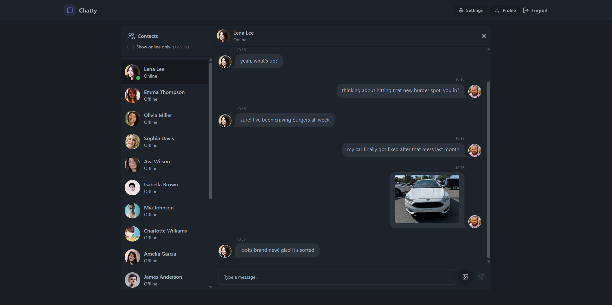

# Chat App 💬

A Full Stack real-time chat application for connecting with friends.

## 🧑‍💻 Tech Stack

- **Language:** JavaScript
- **Frontend:** React, Zustand, DaisyUI, Tailwind CSS, Vite
- **Backend:** Express, MongoDB, Mongoose, dotenv, Socket.IO, Cloudinary
- **Dev Tools:** Nodemon
- **Deployment:** Render

---

## ✨ Features

- **Real-Time Messaging:** Instant chat powered by Socket.IO.
- **Image Sharing:** Send images in chat using Cloudinary integration.
- **User Authentication:** Secure signup, login, and logout flows.
- **Profile Management:** Update profile picture and view account info.
- **Online Status:** See which users are online in real time.
- **Responsive UI:** Mobile-friendly interface with DaisyUI & Tailwind CSS.
- **Theme Support:** Choose from 30+ beautiful themes.
- **Toast Notifications:** Instant feedback for all actions.

---

## 🚀 Screenshots

**Login Page**

**Sign Up Page**

**Chat**

**Profile Page**

**Settings Page (Dark)**

**Settings Page (Retro/Light)**

**Database**

**Deployment**

